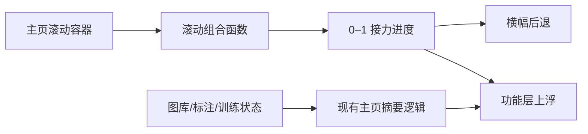

# 仪表盘滚动接力与无横线窗口设计

## 目标

把当前“横幅 + 两块面板”的静态堆叠改成有前后空间感的滚动接力：打开主页时，横幅和人物占据主要视觉区域；用户向下滚动后，横幅轻微后退、缩小和降饱和，下方工作区顺势上浮成为前景。与此同时，去掉窗口顶部与底部的硬横线，让标题栏、内容区和状态栏成为一个连续画面。

本轮只调整仪表盘的空间关系和全局窗口边线，不更换横幅人物、不改主页的真实数据逻辑、不改变侧栏结构，也不增加新的业务入口。

## 已确认的视觉方向

采用“柔和接力”，不采用幅度更大的“电影退场”或“卡片接管”。动效服务于层级，不制造持续晃动：

- 初始状态中，横幅是第一视觉层，约占可用内容高度的 60%–68%。
- 向下滚动约 240–300 像素完成一次接力。
- 横幅最多上移约 32 像素、缩小约 4%–6%、降低少量饱和度与亮度，不使用明显虚化。
- 下方功能区从稍远的位置上升约 60–80 像素，缩放从约 0.96 回到 1，并获得更清晰的阴影和表面层次。
- 反向滚动时所有变化按同一进度自然恢复，不产生弹跳、循环呼吸或惯性拖尾。
- 原有卡片悬停放大、同组退后和键盘焦点效果保留，但只在功能区成为前景后承担主要交互反馈。

## 页面空间结构

### 1. 窗口外壳

标题栏和状态栏继续保留现有功能、尺寸和点击区域，但移除 `border-bottom`、`border-top` 与独立的不透明底色。二者使用应用主背景或透明背景，使页面从最上方到最下方保持连续。

错误状态仍可改变状态栏底色，以保证错误可见，但也不恢复横线。

窗口圆角继续由最外层容器控制，不在标题栏、状态栏和内容区分别绘制轮廓。

### 2. 仪表盘滚动舞台

仪表盘增加一个只负责空间关系的滚动舞台，内部划分为：

- `hero-layer`：横幅主视觉层。
- `workspace-layer`：当前工作与系统监控组成的功能层。
- `scroll-tail`：提供完成接力所需的自然滚动距离，不显示额外卡片或占位文案。

横幅在舞台顶部短暂保持视觉锚点；功能层随页面正常滚动，并在接近横幅时进入前景。实现上不使用固定定位覆盖整个窗口，避免遮挡标题栏、侧栏或其他页面。

在 1400×900 窗口中，初始画面以横幅为主，功能层只露出少量上沿作为滚动提示；完成接力后，功能层完整进入可操作区域。1100×720 下采用更短的横幅高度和更小的接力距离，功能层改为单列，不能产生横向滚动。

### 3. 表面与边框

减少“每一块都被框起来”的感觉：

- 横幅移除 1 像素外边框，依靠圆角、渐变和柔和阴影定义边界。
- 当前工作和系统监控继续是两个独立功能区域，但使用色阶与阴影区分前后，不绘制醒目的外框。
- 图库、数据集、标注三个统计项移除硬边线，改用低对比度底色、留白和悬停反馈。
- 页面背景增加非常克制的品牌色环境光，只在接力区域出现，不形成新的框线。

## 滚动进度与组件边界

新增一个小型组合函数负责滚动进度，不把滚动计算塞进视觉组件：

```ts
useDashboardScrollHandoff(scrollContainer, pageElement)
  -> progress: Ref<number> // 0 到 1
```

职责：

- 监听主页实际滚动容器的 `scroll` 事件。
- 用 `requestAnimationFrame` 合并高频更新。
- 将滚动距离转换成 0–1 的稳定进度并限制边界。
- 页面卸载时取消监听和未完成帧。
- 在系统启用减少动态效果时返回 0，并由响应式样式改为自然上下排列，不运行位移或缩放动画。

`Dashboard.vue` 只负责把进度写入主页根节点的 CSS 自定义属性。`BrandHero.vue` 负责横幅自身的变换；功能层样式继续留在仪表盘页面。业务状态、继续任务优先级和路由兜底不参与滚动计算。

## 状态与数据流



滚动进度是纯展示状态，不写入 Pinia、LocalStorage 或训练任务。离开主页后不保留滚动阶段；重新进入主页时将主页滚动容器恢复到顶部，从横幅主视觉开始。现有继续任务优先级保持不变：运行中训练、未完成标注、最近工作区、已准备数据集、导入素材。

## 交互与可访问性

- 鼠标滚轮、触控板、滚动条和键盘滚动共用同一进度来源。
- 横幅按钮和功能卡片在整个过程中保持正常点击，不使用覆盖层拦截指针。
- 键盘焦点进入功能层时，其内容不能被横幅遮挡。
- `prefers-reduced-motion: reduce` 下取消缩放、位移、滤镜和插值过渡，只保留静态层次与自然文档滚动。
- 窗口高度不足时优先缩短动效距离，不压缩文字或操作按钮。
- 侧栏、标题栏窗口按钮和状态栏始终稳定，不参与视差运动。

## 容错与性能

- 找不到滚动容器时，主页退化为静态布局，不能抛错或阻止页面加载。
- 滚动处理只读取 `scrollTop` 和必要尺寸，视觉变化统一通过 CSS 变量完成，避免每帧触发多处 DOM 写入。
- 同一动画帧最多更新一次；卸载后不得继续调度。
- 不使用实验性的 CSS Scroll Timeline 作为唯一实现，确保当前 Electron 环境与打包版本行为一致。

## 验收标准

### 自动验证

- 滚动进度在负值、区间内和超出距离时分别得到 0、正确比例和 1。
- 高频滚动只合并为每帧一次更新，卸载后监听与动画帧被清理。
- 减少动态效果时不生成位移进度。
- 标题栏没有底部横线，状态栏在正常和错误状态下都没有顶部横线；错误底色仍然存在。
- 首页真实继续任务、统计数据和安全路由回退测试保持通过。
- 类型检查、IPC 契约检查、渲染构建和品牌资源构建通过。

### 真实窗口验收

- 1400×900：初始横幅占据主要视觉区域；向下滚动后横幅柔和后退，功能层完整接管前景。
- 1100×720：功能层单列，交接完整，无横向溢出，文字和按钮不被裁切。
- 反向滚动恢复自然，没有跳帧、闪烁或突然改变层级。
- 顶部、底部不再出现贯穿窗口的硬横线。
- 横幅人物保持原有构图，小人仍只出现在仪表盘。

## 不在本轮范围

- 不更换横幅图片或重新生成角色。
- 不调整图库、标注和训练工作区内部布局。
- 不新增主页业务卡片或推荐算法。
- 不改变侧栏导航信息架构。
- 不发布、不上传，也不生成安装包。

## 临时文件清理

交互草图 `dashboard-scroll-handoff.html` 只用于设计确认。正式实现完成并通过真实窗口验收后删除，不留在项目、安装包或用户系统中。
